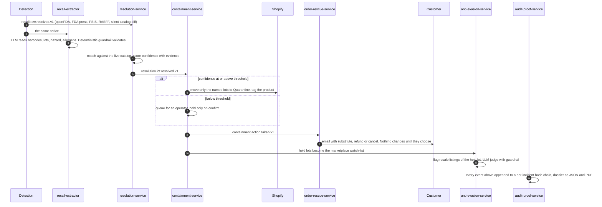

# Sotería

Recall detection, lot-level containment and proof of action for online grocery.

Demo Link: https://app.trupeer.ai/view/OpCNok2s5/soteria

## The problem

Every week, somewhere in the food supply chain, a manufacturer discovers that a batch is unsafe. The FDA and USDA between them announce hundreds of food recalls a year; in one two week window in September 2026 the openFDA enforcement feed alone carried 21 new ones. Each of them lands on retailers that are still selling the product, and on customers who already have it in their kitchen or on the way.

If you have ever ordered groceries online, this is your problem too. The item you bought last Tuesday can be recalled on Thursday, and in most stores nobody tells you. The order ships anyway. The product stays on the site. You find out, if you find out, from the news.

If you run a store, it is your problem twice over.

**Too late.** You learn about the recall from the press release, which comes days after the manufacturer knew, or from the openFDA enforcement report, which comes weeks after that. Some products are pulled from a manufacturer's own catalog with no notice ever filed anywhere. In the gap, the recalled units keep shipping.

**Too much.** A recall names lots, not products. "Lot 1226183" is what the notice says. "Every unit of that noodle kit" is what you pull, because your systems do not know which lot sits in which box. Stock that was never contaminated is thrown away, the product disappears from the storefront for weeks, and customers with orders in flight get a cancellation email and nothing else.

And if you are the regulator or the insurer asking afterwards what was done and when, the answer is reconstructed from Slack messages and memory.

All three are the same problem. Nobody connects the notice to the catalog, the catalog to the lots on the shelf, the shelf to the orders already placed, and the whole sequence to a record that can be trusted. Sotería is that connection. It watches the agency feeds continuously, reads each notice down to the exact barcodes and lot codes, holds only those lots in the store, offers affected customers a substitute or a refund before the order ships, watches resale marketplaces for the held lots reappearing, and writes every step into a hash chain that can be verified later.

Full requirements: [`docs/prd.md`](docs/prd.md).

## What we built

Twelve services on a message bus, two web apps, one shared Shopify integration. Everything runs from one `docker compose up`. The whole chain has been run end to end over a real broker against a live Shopify store with a real FDA notice.



What that means in practice, for the one notice we use as the reference case (FDA H-1258-2026, a ramen kit with undeclared fish, lot 1226183):

1. The notice arrives from openFDA and is matched to the product on the shelf at lot scope with confidence 0.972.
2. 40 units of lot 1226183 move to Quarantine in Shopify. 60 units of the other two lots stay on sale. The product gets a `RECALL_LOT:1226183` tag.
3. On the storefront, typing `1226183` on that product page returns AFFECTED. Typing a clean lot returns SAFE.
4. A customer with an unfulfilled order containing that product gets an email with a refund or cancel option and a link that only works for them.
5. Five resale listings of the same lot on a liquidation marketplace are flagged.
6. The whole sequence, nine events, is in a hash chain that verifies.

Reset, inject, repeat: `tools/democtl` does it in three commands.

## Apps

### Storefront

`apps/storefront`, React, port 5173. A grocery store first: a catalog of real products from Open Food Facts with their ingredients and allergens, product pages, a bag. The recall capability is quiet until it is needed. Every product page has a "check your pack" field; a lot code comes back SAFE, AFFECTED or UNKNOWN_LOT from the resolution service against the live incident set. An affected lot replaces the price with the verdict and puts a banner on the page. The orders page is where a customer lands from the rescue email: the affected line, the options, and a confirm that only works with the consent token from that email.

### Ops console

`apps/ops-console`, React, port 5174. Three screens for the person on duty. The review queue: containment actions that fell below the auto-hold threshold, with the evidence that produced the confidence score, and confirm or reject. Dossiers: every incident, its hash chain, verify, download the PDF. Thresholds: the auto-hold and SKU-scope cutoffs, changeable at runtime without a deploy.

### External systems we connect to

| System | What it is used for | Access |
|---|---|---|
| **Shopify** Admin GraphQL API | The store itself: catalog, the lot ledger (a `soteria.lots` metafield on every variant), inventory moves to a Quarantine location, product tags and badges, orders and order edits | Access token, one custom app |
| **Shopify** Storefront API | Product data for the React storefront | Storefront token |
| **openFDA** | FDA food enforcement reports, polled every five minutes | Keyless, optional key for higher limits |
| **FDA press releases** | The RSS feed plus the full announcement page, the earliest formal signal | Keyless |
| **USDA FSIS** | Meat, poultry and egg recalls the FDA does not cover | Keyless |
| **EU RASFF** | European rapid alert notifications | Portal exports or feed |
| **Open Food Facts** | Ingredients and allergens by barcode, for the storefront and for allergen-safe substitutes | Keyless |
| **Manufacturer storefronts** | Public product catalogs of real food brands, snapshotted to detect products withdrawn without a notice | Keyless |
| **Groq** | The LLM behind notice extraction and the marketplace judge, `openai/gpt-oss-120b` with `gpt-oss-20b` as fallback | API key, free tier |
| **Slack** | Operator alerts: recall contained, containment failed, rescue proposed, evasion flagged | Incoming webhook |
| **Resend** | Customer emails: the rescue offer with its consent link | API key |
| **DigiCert TSA** (RFC 3161) | Anchors each audit chain head in time | Public, keyless |
| **n8n** | Scheduled health checks of every service and alerting when one goes stale | Self-hosted |
| **RabbitMQ** | The bus between every service, topology imported at boot | Local container |

Every one of these degrades explicitly when it is not configured: the store to fixtures, the LLM to a deterministic fake, Slack and Resend to printed messages, the timestamp authority to a hash chain without an anchor. A service always logs which mode it is in.

## Reliability

The system is designed around one question: if this fails, is the failure visible and recoverable, or silent?

**Nothing is dropped.** Every consumer queue is a quorum queue with a delivery limit and a dead-letter queue. A handler that fails five times sends the message to the DLQ instead of retrying forever or discarding it. The audit ledger binds to every exchange that carries incident events, so a dossier is complete or it is not produced.

**At-least-once, with idempotent consumers.** Producers publish with confirms and mark a notice as seen only after the broker acknowledges it. Consumers deduplicate on event id. Incident ids derive from the source and its reference, so a redelivered or re-injected notice is a new delivery of the same incident, not a new incident.

**Three descriptions of the topology that must agree.** The registry in `contracts/rabbitmq-topology.md`, the broker definitions imported at boot, and the queues each service declares on startup are compared by a test. Drift between them fails CI rather than surfacing as a message that never arrives.

**Fixture mode is never silent.** Each service logs at startup which backend it is on. A store configured with a shop but no token refuses to start. Without a Groq key the extractor and the evasion judge run deterministic fakes and say so. Without a Slack webhook or Resend key the notification service prints what it would have sent. Nothing pretends to have acted.

**Feed outages are visible.** Every ingestion service serves `/healthz`, which returns 503 after three consecutive failed polls, when the last success is older than three intervals, or when the broker connection drops, even while idle. `/metrics` is Prometheus text. The n8n workflow polls these and alerts.

**Rate limits are handled, not hit.** The Shopify client throttles on the cost bucket the API reports. Feed clients retry with backoff and honour `Retry-After`. The extractor gives each notice its own five minute budget so a per-minute limit is waited out with the message held, and when the daily quota on the primary model runs out it falls over to a second model with its own quota rather than dead-lettering notices.

**The LLM is never trusted alone.** Every extraction passes a deterministic guardrail: barcodes must be 12 to 14 digits and pass the check digit or be flagged, lot codes must appear verbatim in the notice, dates are not lots. The evasion judge is the same shape: a rules prefilter decides what the model sees, and rules decide what a verdict is allowed to mean. Model responses are cached by content hash, so a redelivery, a restart or an eval run never repeats a call. The extractor scores 1.000 precision and recall on barcodes and lots across 16 real notices.

**Dangerous actions need more evidence.** A hold on a whole product faces a higher threshold than a hold on a named lot. A reviewer may narrow the held lots but never widen them. An unidentified lot code returns UNKNOWN_LOT, never SAFE. A substitute with incomplete allergen data is refused. A swap needs an HMAC consent token from the customer's own email.

**Proof survives tampering.** Each audit record hashes its position, identity, timestamp, producer and payload together with the previous record's hash, so altering, reordering, inserting or deleting any record breaks every hash after it. The chain head goes to a public RFC 3161 authority, which establishes that the content existed by that date. `GET /v1/dossiers/{incident}/verify` recomputes the whole chain.

**Verified against real systems.** The reference case above ran over a real broker against the live store. The three agency feeds return real data from India, where the team is based. The first live run surfaced and fixed five integration bugs that no unit test could have found: a broker that imports definitions does not create its default user, a Shopify inventory mutation that refuses cross-location moves, a metafield that cannot be cleared to empty, a bus deadline shorter than an LLM call, and a daily model quota that turned into a silent timeout.

## Running it

```sh
cp infra/.env.example infra/.env     # broker password required. Shopify, Groq, Slack, Resend optional
cd infra && docker compose up -d     # broker with topology, all twelve services
cd apps/storefront && npm install && npm run dev      # :5173
cd apps/ops-console && npm install && npm run dev     # :5174
```

Without credentials the domain services run on fixtures and the LLM services on fakes; the chain still runs end to end. On Windows with Docker Desktop, build with the classic builder (`DOCKER_BUILDKIT=0 COMPOSE_DOCKER_CLI_BUILD=0`); BuildKit rejects the non-ASCII repo path.

Run the demo:

```sh
cd tools/democtl
go run . reset --restart          # release every hold, clear tags and badges, restart the domain services
go run . order 085315054108       # an unfulfilled test order so the rescue path has something to rescue
go run . inject H-1258-2026       # publish a real FDA notice and watch the chain run
```

Sixteen real notices are available to inject, from `services/recall-extractor/eval/cases.json`. Follow an incident:

```sh
curl "localhost:8081/v1/lots/status?gtin=085315054108&lot_code=1226183"   # SAFE, AFFECTED or UNKNOWN_LOT
curl localhost:8082/v1/containment/actions                                # holds, review queue
curl localhost:8083/v1/rescues                                            # offers made to customers
curl localhost:8087/v1/flags                                              # marketplace listings of held lots
curl localhost:8085/v1/dossiers/<incident>/verify                         # recompute the hash chain
curl localhost:8085/v1/dossiers/<incident>.pdf -o dossier.pdf
```

`tools/demo` runs the core domain services in one process without Docker or a broker, for storefront development.

## Repository map

| Path | Contents |
|---|---|
| `contracts/` | Event JSON Schemas, OpenAPI specifications, the RabbitMQ topology registry. Every service validates what it produces against these in CI |
| `libs/core/` | Event bindings, the bus abstraction (AMQP and in-memory), matching and confidence, the commerce interface |
| `libs/feedkit/` | Poll loop, dedup store, confirming AMQP publisher, health and metrics for the feed connectors |
| `libs/shopify/` | Shopify Admin GraphQL client, the lot-level hold adapter, the in-memory fake, `shopctl` |
| `services/` | The twelve services below, each with its own module, Dockerfile, README and tests |
| `apps/` | Storefront and ops console |
| `infra/` | Compose stack, broker definitions, topology drift test |
| `tools/` | `democtl` (repeatable demo), `seedshop` (seed a store with real products and lot ledgers from live recalls), `offsnapshot` (Open Food Facts allergen snapshot), `demo` (broker-less harness) |
| `tests/` | End-to-end chain tests on the in-process bus; integration tests against a real broker |
| `automation/` | n8n health check and alerting workflow |
| `docs/` | PRD, design notes, security review |

## Testing

Every module has its own CI job. Contract tests validate produced events against `contracts/`. `tests/e2e` asserts the whole chain: surgical containment, the review path, threshold tuning at runtime, redelivery idempotence, refusal of a forged consent token, and reporting of a failed platform write. `tests/integration` runs against a RabbitMQ container: routing, dead-lettering under a failing handler, idempotent queue declaration. The extractor and evasion evals run against real notices and listings with recorded model responses. GitGuardian scans every pull request.

```sh
cd <module> && go vet ./... && go test ./...        # any Go module
cd services/ingestion-silent-diff && pytest         # Python services
cd apps/storefront && npm run lint && npm run build
```

## Configuration

| Variable | Effect |
|---|---|
| `RABBITMQ_URL` | The bus. Unset runs the domain services on an in-process bus |
| `SHOPIFY_SHOP`, `SHOPIFY_ACCESS_TOKEN` | Both or neither. Unset uses fixtures and says so; one alone is a startup error |
| `QUARANTINE_LOCATION` | Where held lots go, default `Quarantine` |
| `AUTO_HOLD_THRESHOLD`, `SKU_SCOPE_THRESHOLD` | Confidence cutoffs, also tunable at runtime through the containment API |
| `GROQ_API_KEY`, `GROQ_MODEL`, `GROQ_FALLBACK_MODEL` | LLM for extraction and the evasion judge; unset runs deterministic fakes |
| `SLACK_WEBHOOK_URL`, `RESEND_API_KEY`, `EMAIL_FROM` | Real delivery; unset prints instead |
| `CONSENT_SECRET` | HMAC secret for customer consent tokens |
| `TSA_URL`, `TSA_DISABLED` | Timestamp authority for the audit chain |
| `OPENFDA_API_KEY` | Optional, raises the openFDA rate limit |

Read [`docs/security-review.md`](docs/security-review.md) before deploying anywhere shared.

## Known gaps

- The audit ledger and the domain services keep incident state in memory. Durable storage is the prerequisite for treating a dossier as evidence across restarts.
- Order rescue picks substitutes from a fixture catalog rather than the live store.
- Resolution matches on the raw notice text; the extractor's structured reading is published but not yet consumed by resolution.
- Anti-evasion runs against a fixture marketplace; the eBay source exists but has no credentials configured.

## Services

| Service | Language | Port | Does |
|---|---|---|---|
| `ingestion-fda` | Go | 8091 | Polls openFDA enforcement reports and the FDA press feed, fetches the full press release page, deduplicates, publishes |
| `ingestion-usda` | Go | 8080 | USDA FSIS recalls for meat, poultry and egg products |
| `ingestion-rasff` | Go | 8080 | EU RASFF notifications, from portal exports or the feed |
| `ingestion-silent-diff` | Python | 8088 | Snapshots real manufacturer Shopify catalogs and reports SKUs that vanish without a notice, with a confidence score and anomaly suppression |
| `recall-extractor` | Go | 8086 | LLM extraction of products, barcodes, lots, hazard and allergens from a notice, validated by a deterministic guardrail |
| `resolution-service` | Go | 8081 | Matches a notice to the live catalog, scores confidence with weighted evidence, answers the lot status query |
| `containment-service` | Go | 8082 | Threshold policy, lot-level hold through the Shopify adapter, operator review queue, runtime threshold tuning |
| `order-rescue-service` | Go | 8083 | Finds unfulfilled orders carrying an affected lot, proposes substitutes with verified allergen coverage, applies a swap only after consent |
| `notification-service` | Go | 8084 | Customer email and operator Slack, with a delivery ledger and a `notification.delivered.v1` event per message |
| `anti-evasion-service` | Python | 8087 | Watches resale marketplaces for held lots, two stage matching (deterministic prefilter, LLM judge, guardrail), publishes flags |
| `audit-proof-service` | Go | 8085 | Hash-chains every incident event, anchors the chain head with an RFC 3161 timestamp authority, renders the dossier |
| `rabbitmq` | | 5672 | The bus. Management UI on 15672 |

The Shopify integration all of these share is `libs/shopify`: one client, an in-memory fake with the same interface for tests and credential-less runs, and the hold adapter. The lot ledger lives in the store itself as a metafield on each variant, so the store is the source of truth for which lot codes are on the shelf and how many units each has. A hold moves exactly those units from the selling location to Quarantine in one paired inventory adjustment, marks the lots held, tags the product and sets a "Verified Safe Lot" badge on the remaining stock. A release reverses every step. Whole-SKU holds, when no lot can be named, unpublish the product instead.
